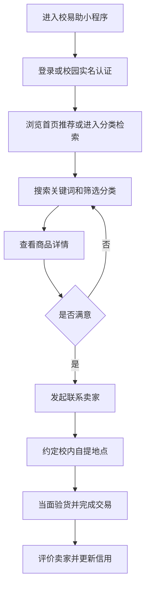
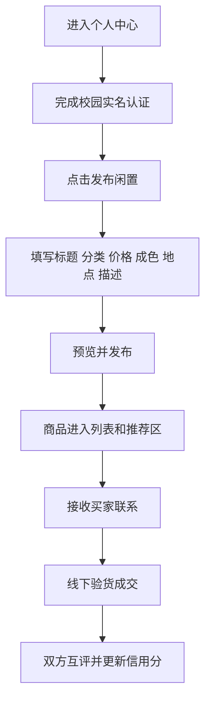
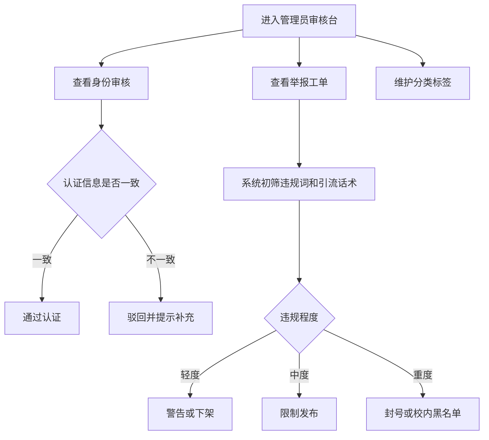

# 校易助用户流程图

## 买家流程

```mermaid
flowchart TD
  A[进入校易助小程序] --> B[登录或校园实名认证]
  B --> C[浏览首页推荐或进入分类检索]
  C --> D[搜索关键词和筛选分类]
  D --> E[查看商品详情]
  E --> F{是否满意}
  F -->|是| G[发起联系卖家]
  G --> H[约定校内自提地点]
  H --> I[当面验货并完成交易]
  I --> J[评价卖家并更新信用]
  F -->|否| D
```

## 卖家流程

```mermaid
flowchart TD
  A[进入个人中心] --> B[完成校园实名认证]
  B --> C[点击发布闲置]
  C --> D[填写标题 分类 价格 成色 地点 描述]
  D --> E[预览并发布]
  E --> F[商品进入列表和推荐区]
  F --> G[接收买家联系]
  G --> H[线下验货成交]
  H --> I[双方互评并更新信用分]
```

## 管理员流程

```mermaid
flowchart TD
  A[进入管理员审核台] --> B[查看身份审核]
  A --> C[查看举报工单]
  A --> D[维护分类标签]
  B --> E{认证信息是否一致}
  E -->|一致| F[通过认证]
  E -->|不一致| G[驳回并提示补充]
  C --> H[系统初筛违规词和引流话术]
  H --> I{违规程度}
  I -->|轻度| J[警告或下架]
  I -->|中度| K[限制发布]
  I -->|重度| L[封号或校内黑名单]
```